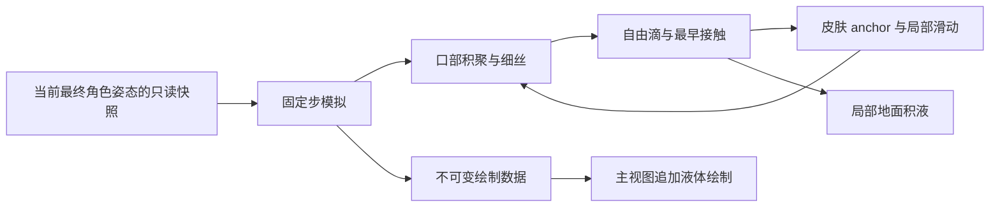

# 高级体液特效：口水沿身体流动的研究与实现计划

日期：2026-10-04。状态：研究方案，尚未实现或在游戏中验证新功能。

研究基线：CombatSimulator `ff2c7a8d05d78da85639d9d9cc0f46ae94f3ba4b`，当前 feature branch；DynamicPortrait `ca82b62334334ee6429294c70cd594ff3ed8a9b3`；VFXEditor `05f6eb0cce19a6a91ae275bce609299d573914b3`；本机 FFXIVClientStructs `1d7452eeae4bd0f6ba02729ace6318da47129c53`。这些是本次阅读版本，原生签名和结构不能当作跨游戏版本保证。

## 1. 推荐路线及判断边界

采用三个相互衔接的简化模型：**皮肤上的稀疏液滴/流痕、空中的黏弹性细丝与液滴、地面的局部积液**。物理在 CPU 上处理有限数量的元素；自建轻量 D3D11 绘制，复用主视图的一次正常渲染。先证明皮肤贴合与深度遮挡可靠，再扩展效果。

这条路线可以覆盖口水积聚、拉丝、断裂、滴到另一个身体部位、沿皮肤滑动、落地汇集的完整视觉链路。它是为游戏效果设计的降维近似，不是完整的非牛顿三维流体求解；论文支持建模思路，不能证明本插件的成本或最终质量。所有性能数值在下文均为待验证目标。

不推荐第一版直接上 SPH/FLIP/MPM：细丝很细，三维解析需要较高空间分辨率，还要处理动态角色边界与液体表面重建。薄膜与细丝研究分别表明这两类形态可以降维处理。[离散液滴薄膜模型](https://arxiv.org/html/2205.05672v1)、[Discrete Viscous Threads](https://ddg.math.uni-goettingen.de/pub/Discrete_Viscous_Threads.pdf)。这是针对本项目规模与维护成本的工程判断，并非所有粒子流体方法都不能实时运行。

最难、最应尽早验证的不是重力积分，而是：**CPU 表面与最终可见皮肤是否一致，以及在正确的主场景阶段追加绘制是否稳定。** 这两项不通过，就不能声称实现了“顺着皮肤 mesh 流淌”。

## 2. 需求与可观察的完成条件

| 需求 | 完成条件 |
| --- | --- |
| 放入 Effects tab | 正常构建可用，不依赖私有 Dev 模块；默认关闭，有立即清理按钮 |
| 从口部积聚和滴落 | 发射点跟随嘴部当前姿态；没有额外喷射速度；静止角色看不到向前喷流 |
| 黏稠与拉丝 | 细丝随拉伸变细、有短暂保持与断裂；不能表现成永不伸长的绳子 |
| 沿皮肤 mesh 流动 | 转头、倒下、抓取时流痕跟随皮肤；滑动方向受世界重力影响；跨三角面没有肉眼跳变 |
| 滴到身体其他部位 | 移动中的手臂、胸口、腿能接住液滴，接触后改变状态；不能隔空吸附到背面 |
| 快速向地面汇集 | 可调的快速滑动和滴落过程，经过实际接触与行程；不把中间过程直接传送到地面 |
| 地面形成积液 | 小水洼与落点、地面坡度相符，能合并和淡出；台阶边不悬空铺整块平面 |
| 效能与兼容 | 固定容量、限定查询与蒙皮量；效果关闭时不扫描角色；不重复游戏更新，不改相机、骨骼或音频入口 |

“更黏稠”和“瞬时滑到地面”可能有视觉张力：黏附很强的细丝通常不会同时无条件高速滑动。因此把**皮肤滑动速度、拉丝松弛、黏附**分开内部建模，提供协调的默认预设；快速滑落可作为艺术化设置，不伪称真实材料测量。

## 3. 当前代码能复用什么

### 3.1 隐藏失禁功能的实际实现

实际名字是 `DeathEffusion`，并非 `Incontinence`：

- [DeathEffusionController.cs](../CombatSimulator/Dev/Experimental/DeathEffusionController.cs)：触发、寿命、重发射与骨骼位置更新。注释说明原始资源是短 burst，约 0.7 秒重新生成以形成连续流。
- [EffusionAssetProvider.cs](../CombatSimulator/Dev/Experimental/EffusionAssetProvider.cs)：私有 DLL 内嵌三份资源，首次使用写入磁盘，通过 `Penumbra.AddTemporaryModAll.V5` 重定向到 `vfx/s.avfx`、`m.avfx`、`l.avfx`。
- [DevExperimentalModule.cs](../CombatSimulator/Dev/Experimental/DevExperimentalModule.cs)：Tick、角色死亡与清理接入。
- [CombatSimulator.csproj](../CombatSimulator/CombatSimulator.csproj)：这些代码与资源只在私有模块存在且不是 PUBLIC_BUILD 时加入。

因此当前实现已内嵌资源，不要求用户另外手工安装原始 VFX mod，但仍依赖 Penumbra 的重定向服务。得到非空 VFX 指针也不能证明资源异步加载成功。这与“自带完整液体算法”不同：控制器没有逐液滴表面接触、细丝求解或积液体积记录。

可借鉴触发/清理模式和角色身份检查；口水的普通 Effects 功能不直接引用私有类、资源或配置。新功能也不沿用 burst 的周期重启作为流动求解。

已有坐标陷阱：该控制器明确记录 actor-attached VFX 的 Position 是 actor 局部偏移，误写世界坐标曾使效果飞到很远。新状态统一用世界空间，骨骼与蒙皮只在适配层转换一次。

### 3.2 VFXEditor 暴露的能力和局限

阅读本机 VFXEditor 的下列源文件：

- [AvfxEmitter.cs](../../Dalamud-VFXEditor/VFXEditor/Formats/AvfxFormat/Emitter/AvfxEmitter.cs)：有 Gravity、AirResistance、发射位置、随机速度与数量曲线。
- [AvfxParticle.cs](../../Dalamud-VFXEditor/VFXEditor/Formats/AvfxFormat/Particle/AvfxParticle.cs)：有 Depth Test、Depth Write、Collision Type 字段。
- [AvfxParticleDataModelSkin.cs](../../Dalamud-VFXEditor/VFXEditor/Formats/AvfxFormat/Particle/Data/AvfxParticleDataModelSkin.cs)：有 Fresnel、Aura Target、颜色等参数。

对应公开来源：[VFXEditor 源码](https://github.com/0ceal0t/Dalamud-VFXEditor/tree/05f6eb0cce19a6a91ae275bce609299d573914b3/VFXEditor/Formats/AvfxFormat)。

这些证据足以支持制作“低初速度、重力滴落、带透明材质”的原生资源候选。**字段名不能证明它支持任意角色三角面接触回调、皮肤上的逐滴运动、运行时动态细丝节点。** 特别是 ModelSkin 不能直接解释成“液体沿皮肤求解器”。本次未解析内嵌 `.dat` 的实际 AVFX 参数，不能断言旧资源的 Collision Type 配置。

判断：纯 AVFX 可作为廉价滴落外观候选，不能作为完整需求已有支持的论据；完整路线优先自建状态与几何。若自建渲染早期失败，可做原生 VFX 小实验，但需重新说明能满足的范围。

### 3.3 现有 mesh、蒙皮和骨骼读取

代码证据：

- [RagdollController.cs](../CombatSimulator/Animation/RagdollController.cs)：`TryLoadMeshCollisionMdlData`、`TryBuildSkinDeltas`、`BuildMdlMeshBoneMap`、`SkinVertex`，已有 MDL 顶点/索引读取及骨骼映射。
- [RagdollController.WeaponMesh.cs](../CombatSimulator/Animation/RagdollController.WeaponMesh.cs)：处理绝对 mod 路径、部分路径前缀、LOD 与 extra mesh 范围；可以作为加载适配的参考。
- [RagdollController.SoftTissueMesh.cs](../CombatSimulator/Animation/RagdollController.SoftTissueMesh.cs)：蒙皮后按骨骼采样以拟合软组织代理，最终结果是胶囊拟合，并非可供液体行走的连续三角表面。
- [BoneTransformService.cs](../CombatSimulator/Animation/BoneTransformService.cs)：提供 `GetBoneWorldTransform`、骨骼访问与 `OnRenderFrame`。事件在 native Original 之前执行，现有 ragdoll 也订阅它。

复用解析知识，不在每帧调用现有整套建模函数：`TryBuildSkinDeltas` 当前会分配数组并重新建立参考变换、求逆；`BuildWeaponMesh` 也会读文件、遍历模型和做凸分解。这些不适合作为液体热路径。

新增只读表面服务，缓存参考骨架逆矩阵、拓扑和骨骼映射；每帧只更新相关骨骼和被用到的顶点。必要时仅抽取纯工具，但不重构 ragdoll 的碰撞求解器。

必须核验：当前读取的 MDL 是否就是屏幕上渲染的资源；材质隐藏/装备遮挡、partial skeleton、非均匀 scale、皮肤变形插件是否超出 CPU 蒙皮近似。普通 `GameData.GetFile` 本身不能保证读到 Penumbra 最终重定向内容。不能把身体被衣服覆盖的内部 mesh 也当成可接触皮肤。

### 3.4 Dynamic Portrait 的参考价值

代码：[RenderCommandQueue.cs](../../DynamicPortrait/DynamicPortrait/Rendering/RenderCommandQueue.cs)、[PortraitRenderer.cs](../../DynamicPortrait/DynamicPortrait/Rendering/PortraitRenderer.cs)、[OpaqueTexturePass.cs](../../DynamicPortrait/DynamicPortrait/Rendering/OpaqueTexturePass.cs)。

调查记录：[SHARED_RENDER_STATE.md](../../DynamicPortrait/docs/SHARED_RENDER_STATE.md)、[PERFORMANCE_NEXT_STEPS.md](../../DynamicPortrait/docs/PERFORMANCE_NEXT_STEPS.md)。

它证明本机客户端可通过原生 render command marker 和 D3D11 接口接入 GPU 工作；也给出 target 有效性检查、COM 引用管理与状态恢复实例。它主要实现捕获/额外视图，**没有证明当前口水所需的主视图液体绘制阶段和深度接口已经可用**。

其调查记录确认过额外视图污染 CPU 相机历史；特定带诊断测试的 Tick 中位耗时从 16.55 ms 到 32.87 ms。这是该实验的证据，不是本功能的性能预测。新功能不得重放 Framework.Tick、Scene.Update/PostUpdate，不得切换相机或修改 AA 选项。

现有 marker 使用真实 target 作 fallback，原因是该客户端零 target 命令可能崩溃。新 renderer 要自行验证命令阶段，不能直接复制“capture marker 之后必然适合液体绘制”的假设。

该项目是 AGPL，而 CombatSimulator 是 MPL-2.0。采用架构经验和独立实现；若以后确需移植具体代码，单独处理许可与归属，不能把相邻项目当成同许可工具库。

## 4. 物理依据与具体近似

### 4.1 皮肤上的表面运动

主要依据：[A Discrete Droplet Method for Modelling Thin Film Flows，2022，§3.2–3.3](https://arxiv.org/html/2205.05672v1)。论文将薄膜表示为沿曲面移动的液滴，使用切向重力、表面相对速度的黏性阻力及压力；跨边后移到邻接表面元素。这直接对应皮肤上的运动需求，但论文方法并不是可直接套用的 FFXIV 实时实现。

液滴 anchor 保存 `{actorGeneration, meshGeneration, triangleId, barycentric, volume, tangentialVelocity}`。三角面三个当前世界顶点为 a、b、c，则表面点为 `p = b0*a + b1*b + b2*c`，再加很小的法线偏移用于绘制。骨骼动作自然带动该点，不对旧世界位置每帧全身找最近点。

沿面运动以相对皮肤的切向速度 u 为状态：

```text
gt = g - dot(g, n) * n
du/dt = gt - k*u             // 第一版省略压力梯度的视觉近似
k ≈ viscosity / (density * effectiveFilmHeight²)
uNext = u*exp(-k*dt) + gt*(1-exp(-k*dt))/k
```

最后一式是对本方案线性阻尼近似的解析积分，避免很薄液层使显式阻尼数值发散；k 接近零时使用连续极限。effectiveFilmHeight 有下限和上限，不能用几乎零厚度算出无穷阻力。这里的 viscosity 首先是校准后的视觉参数，不宣称是测量出的口水黏度。

面内推进使用重心坐标，遇到边只走拓扑邻接；把切向速度运输到新面切平面。每步限制跨边次数；未用完的行程按剩余步长处理，禁止最近点查询把液滴从胸口直接吸到邻近手臂。缺边或缝线不能无条件焊接：只允许经位置、骨权重和法线验证的 seam 对应，禁止把隔着空气的两片皮肤连接成一个面。

表面论文完整模型还有压力、毛细效应和邻域重构。第一版仅采用简化阻尼、有限邻域合并与接触迟滞；不声称已复现完整 DDM，也不保证物理准确的 contact line。

移动皮肤额外问题：身体加速和法线翻转可能导致脱离。前后 pose 给出表面速度；先实现稳健的跟随和脱离判定，再校准惯性项，不能通过 `gt` 单项覆盖所有快速甩动。初期一次限时保留接触、超过阈值转自由滴；参数使用分离阈值，避免逐帧贴附/脱离抖动。

### 4.2 黏弹性细丝

材料行为依据：[Wagner & McKinley，2017，Age-dependent capillary thinning dynamics of physically-associated salivary mucin networks](https://dspace.mit.edu/handle/1721.1/119828)。其结果区分剪切流变与拉伸细化、松弛及断裂行为，支持“滑动黏度与拉丝寿命分开”的设计。这里不使用该论文给不同玩家角色规定生理数值，也不模拟样本老化。

降维依据：[Discrete Viscous Threads，2010](https://ddg.math.uni-goettingen.de/pub/Discrete_Viscous_Threads.pdf)：以一维线程表示薄液丝，并处理伸长、弯曲和断裂。该论文主要是黏性线程，不能单独替代口水的黏弹性材料模型。

实现建议：每条丝有限节点，口部端是运动学 anchor，自由端是液滴或另一皮肤 anchor。节点受重力、有限阻尼、拉伸/弯曲和接触约束。用 [XPBD，2016](https://mmacklin.com/xpbd.pdf) 的 compliance 形式，避免普通 PBD 的刚度严重依赖 timestep/迭代数；有限迭代仍有求解误差，必须做不同帧率对照。

```text
alphaTilde = compliance / dt²
deltaLambda = (-C - alphaTilde*lambda) /
              (sum(inverseMass * gradientLength²) + alphaTilde)
radius = sqrt(segmentVolume / (pi * segmentLength))
```

XPBD 只是约束工具，不会自动把绳子变成液体。需要另加一个工程性的黏弹松弛模型：段自然长度朝当前长度以受限速率松弛，有限延伸后出现颈缩；达到最小半径、最大应变或保持超阈时间后断裂。单独的长度上限只作为数值保护，不能在画面上把端点硬拉回。

体积随分段重采样分配；增长/断裂时记录转移，不能因为补节点而增加液体。与身体接触后创建表面沉积，剩余细丝可以继续连接；附着端点与接触约束进入同一求解次序，不能另一个控制器在下一阶段把位置写回。

这比完整黏弹细丝本构简单。若游戏内仍明显像橡皮绳，先改松弛/颈缩模型；必要时升级一维隐式黏性模型，而不是盲目增加节点或迭代次数。

### 4.3 自由液滴和移动表面的接触

口部“零喷射初速”解释为 `vJet = 0`；实际释放速度应包含该口部点的世界运动速度。否则奔跑或被抓取时液滴会突然停在旧位置。贴附液滴脱离时继承皮肤速度加相对滑动速度；已有 BoneTransformService 的世界坐标读取和表面模型中的 `Vs` 是此设计依据。

每个固定步从旧位置到预测位置做有限半径的 swept contact。角色部分使用骨骼/区域代理作 broadphase，命中候选区域后才蒙皮并测相关三角面；最终接触保存真实三角面 anchor。代理仅用于筛选，不能把胶囊当成最终可见皮肤。

仅测试终点会在快动作下漏碰。只扫液滴相对静止的新 pose 也可能漏掉迎面移动的手臂：候选 AABB 覆盖前后 pose；用有限的相对运动子步或移动三角形接触近似。细丝线段也要检查相关表面，防止只有节点不穿而线段穿入胸口。

先以单 actor 自接触实现，接口保留多个有限 actor。命中按最早接触时间处理，掠过/背向/已在内部的情况明确分支；源面只在短距离与短时间内过滤，不能永久忽略同一角色。接触后按黏附/掠射决定沉积、继续自由滴或分配少量残滴；状态切换只有一个负责人。

### 4.4 地面和积液

API 证据：[本机 BGCollisionModule.cs](../../FFXIVClientStructs/FFXIVClientStructs/FFXIV/Common/Component/BGCollision/BGCollisionModule.cs)，有 `RaycastMaterialFilter`、Point、三角顶点、Material 与 Distance。Normal 注释说明并非所有 collider 类型都填写。接口定义来源是客户端逆向结构，不是官方稳定 SDK。

**不要假设 `SweepSphereMaterialFilter` 能传入任意液滴半径。** 当前公开包装参数没有 radius；需另行查明语义。第一版使用短路径 raycast，必要时有限偏移射线近似滴半径。若 Normal 无效且三角顶点有效，计算三角法线；两者都不可靠时不生成精确积液。

地面命中建立小片局部网格，中心和少量边界探针限定生成范围；缓存结果，仅扩展边界时再探测。跨台阶或采样不连续处分裂 patch；没有可靠地面时液滴有限寿命退出，不造全地图 y=常数平面。

积液记录体积、湿润范围和年龄，用局部邻域合并。近水平地面扩展为小浅水洼；陡坡继续沿坡流动，不无条件铺圆形池。减少体积的淡出/蒸发是显式视觉规则。

## 5. 数据所有权与更新顺序

建议代码边界：

| 模块 | 职责 | 明确不拥有的状态 |
| --- | --- | --- |
| `BodyFluidController` | 唯一模拟调度、触发、体积转移与状态切换 | 相机和角色骨骼 |
| `CharacterFluidSurface` | 已显示模型的只读拓扑、pose snapshot、anchor 查询 | ragdoll 力与 joint 参数 |
| `SurfaceFlowSolver` | 已附着液体的局部面内推进 | 空中线程端点的另一次强制定位 |
| `FilamentSolver` | 节点、松弛、断裂与统一接触约束 | 新建游戏更新循环 |
| `FluidGroundCache` | 局部 BG 查询与积液 patch | 世界全量地形 mesh |
| `BodyFluidRenderer` | 一次提交有限几何、状态恢复、GPU 资源生命周期 | 模拟时间与随机发射 |
| `MainWindow.BodyFluids` | Effects 控件与可理解的能力状态 | 原生 hook 参数配置 |

这些名字是计划中的新增模块，并非已有 API。



关键时序：先让既有角色动画/ragdoll/抓取完成本帧姿态，再采样。现有 OnRenderFrame 是 pre-Original，订阅顺序本身不足以证明“最终 pose”。早期探针比较 event 后、native Original 后与游戏可见顶点，选出可靠的只读采样位置。不能让液体服务为了读 pose 调用第二遍动画更新或默认写 `SyncModelSpace` 来覆盖其他插件结果。

固定模拟步建议初值 1/60 秒，最多 2 个追赶步；卡顿后限制 backlog，暂停/长失焦后重新建立跟随，避免恢复一帧集中生成大量液滴。pose 按固定步时间从快照插值，口部 anchor 和相关皮肤使用同一 pose 时间。

绘制时表面 anchor 可根据当前 pose 重建，不必等待下次物理 tick；细丝锚端与自由节点要用一致的显示时序，防止两端错帧而抖动。要验证这种重建是否带来接触误差，不能各自额外做指数平滑。

状态以单向转移事件实现：mouth reservoir → filament/free drop → surface deposit → free drop → puddle。贴附/脱离阈值带迟滞；细丝约束与碰撞在同一有限迭代中处理，迭代结束再提交断裂/沉积事件。每个体积份额只在一个状态中出现。

actor key 不只存裸指针，应包含游戏对象身份、draw/model generation 和 territory；换装、重绘、变身、删除后旧 anchor 作废，禁止继续解引用旧资源。

## 6. 渲染 API、画质和早期验证

### 6.1 选择绘制阶段

优先寻找主视图的场景颜色/深度已有效、UI 尚未绘制的阶段；分别记录透明 pass、后处理、动态分辨率与投影 jitter 的关系。需要对当前实际客户端做有限观察，不能凭函数名选择插入点。每个主视图 frame 最多提交一次。

两个候选有不同代价：

| 候选 | 好处 | 必须验证的问题 |
| --- | --- | --- |
| 后处理前场景 pass | 分辨率/深度往往一致，特效可进入部分后处理 | temporal history、motion vectors、角色透明物体顺序 |
| 后处理后、UI 前合成 | 较少影响游戏历史 | 场景深度可能低分辨率，jitter/upsampling 对齐，液体自身抗锯齿 |

早期比较后选择。第一版不为追求完美 TAA 强行写游戏 velocity/history texture；以小范围稳定视觉验收决定可行路径。Present 阶段可用于观察，不能默认它仍绑定可用主场景深度，也不能把流体画在 UI 顶上。

### 6.2 深度、格式和资源绑定

已查 API：

- [OMGetRenderTargets](https://learn.microsoft.com/en-us/windows/win32/api/d3d11/nf-d3d11-id3d11devicecontext-omgetrendertargets)：可读当前 RTV/DSV；返回接口增加引用，需要 Release。
- [OMSetRenderTargets](https://learn.microsoft.com/en-us/windows/win32/api/d3d11/nf-d3d11-id3d11devicecontext-omsetrendertargets)：绑定时可能解除冲突的输入/输出资源；RT 和 depth 的 sample count/尺寸需匹配。
- [Configuring Depth-Stencil Functionality](https://learn.microsoft.com/en-us/windows/win32/direct3d11/d3d10-graphics-programming-guide-depth-stencil)：把深度作为 SRV 读取要求底层格式和 bind flags 支持，不是取得 DSV 后总能直接创建 SRV。
- [Introduction to Multithreading in Direct3D 11](https://learn.microsoft.com/en-us/windows/win32/direct3d11/overviews-direct3d-11-render-multi-thread-intro)：context 不可无保护并发使用，GPU 调用留在经过验证的渲染线程。

第一版优先复用匹配的 DSV 做固定功能 depth test，DepthWrite=ZERO；不采样深度的基础材质无需 depth SRV。若实际阶段只有不匹配的深度，再研究合法 GPU 拷贝/兼容 view；不能改游戏资源创建描述、强转格式或每帧 CPU 回读。reversed-Z 比较方向、viewport、projection、矩阵约定和 jitter 必须实测，不能照搬 Microsoft 示例的 LESS。

如果无法取得正确遮挡，停止完整 renderer 路线的扩展，不以 ImGui 2D overlay 冒充皮肤贴合或遮挡正确。

### 6.3 几何与材料

初版用程序生成资产，不需要先制作口水 AVFX：自由滴用低面数椭球实例；近景细丝用少边数管，远景用 ribbon；皮肤湿痕用 anchor 对应的局部三角片/细条，地面用小 patch。

皮肤流痕的边缘也要沿实际表面生成，不能只把中线贴住、两侧平面浮在弯曲皮肤上。法线偏移按几何尺度上限控制，限制厚度，避免靠大 depth bias 穿透衣服或轮廓。积液同理处理 z-fighting。Microsoft 深度文档说明共面几何会产生闪烁，这构成该步骤的直接依据。

基础材料提供低不透明度、平滑高光、随视角增强的边缘反射与随厚度变化的外观。它是视觉近似；没有实际光照数据时不能声称真实环境反射。暂不修改原有皮肤材质、normal map 或角色 shader，湿痕仅追加几何。

先验证无折射版本。需要透明感更强时，下一阶段研究一次私有 scene-color copy 做有限屏幕空间折射；颜色输入不得与当前写入的 RTV 同资源绑定。它不能看见屏幕外/被遮住的背景，不承诺真实折射。透明排序先按滴/丝/patch 的有限几何排序；自身严重交叠时再评估额外 OIT pass 的成本。

### 6.4 状态恢复与上传

独立建立 D3D11 state scope，保存实际会改动的 IA、shader/class instances、CB、SRV/sampler、RS viewport/scissor/rasterizer、OM targets/blend/depth/stencilRef，以及可能被冲突解绑的相关绑定。若会影响 UAV、predication 或其他阶段，也必须纳入恢复或避开；不能以“只改 PS 所以只恢复 PS”作假设。finally 恢复并释放 getters 增加的引用。

实例/顶点缓冲预分配，按批更新；依据 [How to Use dynamic resources](https://learn.microsoft.com/en-us/windows/win32/direct3d11/how-to--use-dynamic-resources)，使用 DYNAMIC + WRITE_DISCARD，不反复 Map 正被 GPU 使用的静态 buffer。不能保证 WRITE_DISCARD 永不等待，仍需采样成本。

resize、device loss 与 unload 时停止接收新 draw 数据，等待已提交命令可安全退出；游戏对象引用与自建 COM 对象分清。既有 marker 回调原函数只按定义转发一次，不跳过别的插件工作。DynamicPortrait 同时开启时按 view identity 区分；第一版仅保证主视图，portrait 不重复运行模拟。若视图无法可靠区分，明确禁用该组合，而不是全局改相机绕过问题。

## 7. 性能设计和预算

以下为单个近景角色的初始目标，并非已经跑出的数据：

| 项目 | 初始上限/目标 | 超限行为 |
| --- | --- | --- |
| active actors | 首版 1 个，接口允许以后受限扩展 | 新 emitter 排队或不创建 |
| surface deposits / free drops | 128 / 64 | 合并附近沉积，停止新增远处小滴 |
| filaments | 8 条，每条最多 16 节点 | 合并发射或先停发，保留现有链路 |
| puddle patches | 16 | 合并同一地面区域，最旧 patch 渐隐 |
| 每固定步相关蒙皮顶点 | 初值 4096，先测实际需要 | 精确接触工作排队；不偷偷扫全身 |
| 表面跨边 | 每滴每步最多 8 次 | 限制本步行程并记录，禁止无限 walk |
| terrain queries | 每步最多 32 个 | 优先自由滴即将落地，再扩展水洼边界 |
| steady-state CPU p95 | 总增量目标 ≤ 0.5 ms/frame | 减发射/细丝细分，不破坏碰撞或增加 dt |
| GPU p95 | 目标 ≤ 0.5 ms/frame，取决于分辨率/设备 | 降低几何和折射质量 |
| 热路径托管分配 | 稳态目标 0 B/frame | 审计数组、LINQ、日志、集合增长 |

顶点数量上限本身不能保证三角测试量；另设候选 triangle/CCD 测试预算并在阶段 2 测量定值。每 actor 用骨骼 cluster 的保守范围过滤，再查询局部面片。不要在 bind-pose BVH 上直接用世界射线查询而忽略变形；区域 bounds 必须跟随当前骨骼并覆盖运动。

静态顶点、索引、邻接与参考骨架构建一次。文件读取、拓扑建立和 shader 编译不能放热路径；从可安全读取的模型信息生成纯托管快照，后台只能处理此快照，不访问 native actor 指针。后台结果用 generation 校验后发布。有限 cache 必须记录 bytes 与淘汰条件，不让换装不断增长。

CPU 统计拆分 pose capture、局部 skinning、collision、surface、filament、draw upload。GPU 用 timestamp/disjoint query 延迟读取，依据 [GetData](https://learn.microsoft.com/en-us/windows/win32/api/d3d11/nf-d3d11-id3d11devicecontext-getdata) 和 [TIMESTAMP_DISJOINT](https://learn.microsoft.com/en-us/windows/win32/api/d3d11/ns-d3d11-d3d11_query_data_timestamp_disjoint)；结果未就绪就下帧读取，禁止 busy wait/强制 Flush。记录 p50/p95/p99、frame spikes、内存和 overdraw；FPS 单数不足以证明实现高效。

降级优先减少液体数量和高成本外观。不能通过取消地面/角色碰撞导致大量穿模，也不能把远角色的全部时间积压在回到近景时一次追赶。

## 8. 最终分阶段实施计划：操作、依据、交付、门槛

### 阶段 0：需求基线和只读诊断

**操作**：新增限时游戏内诊断命令，记录当前视图、渲染阶段、RTV/DSV 描述、pose 可读性与身份；采样固定容量，结束后恢复。选择站立、转头、倒下、被抓取作为同场景对照。效果保持关闭。

**依据**：BoneTransformService 的回调时机、DynamicPortrait 的 render marker 与共享状态调查、Microsoft OMGetRenderTargets。现有接口可以观察相关数据，但阶段顺序需要本客户端验证。

**交付与门槛**：列出确定的 pose snapshot 时机与 draw 时机、深度格式/尺寸/采样数、jitter/投影约定；确认不会额外调用 Tick/动画。缺少这些信息不进入大规模算法实现。

### 阶段 1：极小自建绘制实验

**操作**：仅绘制一个固定世界空间液滴和一小条测试丝；做好 state scope、一次主视图提交、关闭与 resize 清理。分别置于角色前后、墙后、地面附近，移动相机观察。开启 Dynamic Camera、常用插件和 DynamicPortrait 做兼容对照。

**依据**：D3D11 depth/state/thread API，DynamicPortrait 已验证的接入方式与失败记录；基础几何不需要外部口水 VFX。

**交付与门槛**：正确遮挡、不覆盖 UI、无主视图重复提交、AA/动态分辨率变化无明显错位；无新增相机抖动、姿态变化、显著帧尖峰。失败时先解决渲染接入，不堆物理修复。

### 阶段 2：只读皮肤表面与嘴部 anchor

**操作**：建立缓存拓扑/骨权重/参考逆矩阵，按实际资源与 generation 加载。选择口部骨骼候选并用局部偏移校准嘴唇位置；骨骼名不能全种族硬编码。只在少量表面 anchor 绘制标记，不发液体。

**依据**：本 repo 的 MDL/蒙皮工具、GetBoneWorldTransform、WeaponMesh 对 mod 路径的处理；重心坐标是三角表面点的直接表示。

**交付与门槛**：站立、旋转、倒下、抓取、scale 与换装后标记贴皮肤；可区分露肤/衣物/隐藏模型。记录误差，近景目标是液滴半径数量级以内，无明显浮空/穿入。特殊 deform/mod 不支持时给出实际状态；不得默默使用原版 mesh。当需求要求的角色模型不通过时，先补表面适配。

### 阶段 3：最低成本的口部积聚、自由滴与落地

**操作**：建立唯一体积状态、固定步、source reservoir；无喷射释放，继承 source velocity。先做有限自由滴、BG 地面路径查询和一个小积液 patch。

**依据**：表面模型的相对速度建模、现有骨骼世界变换和 BGCollision API；地面三角/法线信息存在但可靠性要核验。

**交付与门槛**：静止口部垂直滴落；角色快速移动时不出现不自然喷射/旧位置停留；不同帧率总发射量基本一致；坡地、凹地、台阶正确落点。有限模拟窗口体积账满足 `emitted = active + deposited + expired`，初始容许误差目标 < 1%，上限拒发另记，不计为已发射。

### 阶段 4：沿皮肤的局部滑动

**操作**：加入切向重力、解析阻尼积分、邻接面 walk、有限黏附/脱离迟滞；同一区域沉积合并。生成贴面湿痕条带。先验证慢滑，再调快速滑落预设。

**依据**：DDM §3.2–3.3 的切向运动与邻接面转换；现有 CPU skinning；深度文档的共面闪烁说明。第一版省略部分压力项已明确。

**交付与门槛**：面朝上/下、侧躺、翻身方向合理；不在 mesh seam 跳跃；不会从一片皮肤直接吸到隔空的另一片；衣物外层能遮挡内部皮肤。快滑落仍能看见连续行程，无接触状态来回闪。

### 阶段 5：移动身体接住自由滴

**操作**：增加 pose 前后 bounds、有限动态表面 CCD、最早命中排序、接触后体积转移；包括同一角色的其他部位，先不扩散到任意地图 NPC。

**依据**：阶段 2 可用三角表面、阶段 3 自由滴路径与阶段 4 attached state 的组合；连续/相对运动检测是针对当前单帧测试漏碰的工程设计，不声称引用某论文就已解决 CCD。

**交付与门槛**：手臂横扫接滴、胸口接滴、贴近另一部位时接触位置正确；快倒下/抓取没有显著穿透；最坏姿态下查询/蒙皮预算有界。后续增加 actor 数量前先确认单 actor p95 达标。

### 阶段 6：黏弹细丝、颈缩和断裂

**操作**：有限 XPBD 节点与 contact constraints，加入自然长度松弛、体积半径变化、有限延伸/断裂，端点在嘴部/皮肤/液滴之间转换。减少渲染细分不影响模拟体积。

**依据**：Wagner & McKinley 支持材料参数分开；Discrete Viscous Threads 支持线程降维；XPBD 给出明确 compliance/timestep 关系。松弛与阈值是待游戏校准的简化材料模型。

**交付与门槛**：转头和拉开距离时丝能拉长变细并断开；不反弹成橡皮绳；断裂形成有限残滴并保持体积；倒地压丝时不穿身体；30/60/120 FPS 形态与寿命无明显系统偏差。若误差来自有限迭代先分析残差，不盲目提升全局频率。

### 阶段 7：完成积液与基础画质

**操作**：积液局部合并、沿坡运动、边界采样、体积/面积约束和淡出；完善近景管状丝、贴面湿痕、透明排序和材质。基础效果过关后再评估一次 scene-color copy 的折射增强。

**依据**：阶段 3–5 的实际接触数据、BGCollision 地面查询与 D3D11 资源 hazard/动态上传规则。小 patch 与有限排序是性能导向的工程近似。

**交付与门槛**：落点和汇集过程连续，池不随角色走、不跨台阶悬空；近景/逆光可辨识，不用强发光假装透明液体；无 z-fighting。折射若引入帧尖峰、temporal 问题或绑定冲突，基础效果仍可独立交付。

### 阶段 8：Effects UI、发布构建和完整实机验收

**操作**：增加启用、手动开始/停止、流量、皮肤流动速度、拉丝强度/寿命、积液保留与统一清理。默认关闭，提供低成本预设；内部碰撞阈值/原生接口不塞进普通用户流程。将生命周期绑定到 logout/territory/object redraw/unload。

**依据**：MainWindow 既有 Effects tab、csproj 的 PUBLIC_BUILD 排除规则、Dev Effusion 的触发清理模式；前述接口与算法已经分阶段通过实机验收。

**交付与门槛**：按已有位置构建插件，在真实游戏做全部回归；正常与 PUBLIC_BUILD 均不依赖私有资源。通过下方矩阵和性能记录后才 commit；push 只到当前 feature branch，仍按用户当时的明确指令执行。

## 9. 实机测试矩阵与回退条件

本计划的视觉与性能验证均在游戏中完成。不以独立模拟脚本的“数学正常”代替实际角色/插件互动。

| 场景 | 观察项 |
| --- | --- |
| 静止站立，正面/侧面/背面镜头 | 嘴部发射点、零喷射、身体遮挡 |
| 转头、跑动、被抓取 | source velocity、最终 pose 同步、细丝松弛 |
| 倒下全过程、趴/仰/侧躺、翻身 | 表面方向变化、自接触、细丝压在皮肤上 |
| 手臂/腿快速穿过滴落路径 | 动态表面漏碰与最早接触 |
| 平地、坡地、凹陷、台阶 | 地面落点、小池边界、无悬空 |
| 原版、装备遮挡、可用身体 mod/scale | 实际 mesh 资源、隐藏面过滤、贴合误差 |
| 30/60/120 FPS、短暂停顿后恢复 | 发射体积、丝断裂寿命、无追赶尖峰 |
| 分辨率变化、AA/动态分辨率、镜头近远 | 深度/jitter、透明闪烁、overdraw |
| Active/Dynamic Camera、常用变形插件、DynamicPortrait | 姿态和相机无新增变化、按视图区分提交 |
| 换装/redraw、切地图、logout、重载 | anchor generation、COM/缓存回收，无旧 native 引用 |
| 持续运行与反复清理 | 资源数量有界，无单调增长或逐帧日志开销 |

对照规则：同一游戏场景，效果关闭/开启交替，先测无详细诊断模式；需要定位时再打开有限探针。CPU/GPU 原始样本、配置、插件组合和画面现象一同记录，不能用低 FPS 掩盖抖动。

回退只影响新液体模块。出现相机抖动、角色 pose 改变、渲染状态污染、异常尖峰或不安全资源生命周期，立即关闭新模块并定位，保持现有相机/抓取/ragdoll/音频行为。每阶段只追加可单独停用的一项能力，避免把多个未验证改动同时加载进游戏。

## 10. 尚未确定的事项

| 事项 | 现有证据 | 解决阶段 |
| --- | --- | --- |
| 哪个回调是最终可见 pose | pre-Original OnRenderFrame 和 ragdoll 订阅已确认；最终顺序未验证 | 0、2 |
| 主视图 draw 的最佳阶段 | DynamicPortrait 有接入实例；无液体深度测试验证 | 0、1 |
| 真实主场景 DSV/深度 SRV 可用性 | D3D11 API 条件清楚，客户端资源描述未采样 | 0、1 |
| CPU mesh 与特定 mod 一致 | 已有 MDL/路径处理；GPU/材质变形的完整一致性未知 | 2 |
| 隐藏面/衣物过滤 | 现有碰撞工具不等于 renderer 可见表面服务 | 2 |
| 任意半径 BG sphere sweep | 当前包装无 radius，语义未确认 | 3；不依赖它启动 |
| 合适的口水视觉参数 | 论文支持行为区别，不能提供通用游戏预设 | 4、6 实机校准 |
| 多 actor 性能 | 尚无本功能数据 | 单 actor 全链路过关后 |
| portrait 内显示液体 | 多视图阶段身份仍待核验 | 初版主视图后评估 |

这份计划给出的下一步是**小规模渲染/贴肤验证**，而不是一次实现全部求解器。整体可行性目前有源码和模型层面的依据；画质、兼容性与成本需要这些门槛产生实际游戏证据。
